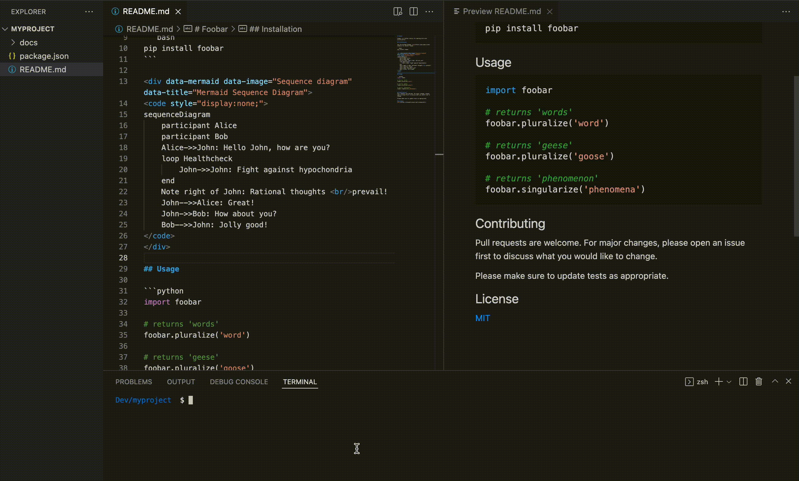

# mimc
### Mermaid Image Markdown Creator

The command-line solution for creating [mermaid](https://mermaid-js.github.io/) diagrams and visualizations in markdown (ex: [bitbucket](https://www.atlassian.com/software/bitbucket/enterprise)) by generating the png and automatically importing them.

## Installation

```bash
npm install mimc
```

## Quick Start
You can write code the diagram code with help of [mermaid live editor](https://mermaid-js.github.io/mermaid-live-editor/).

### Usage

In the README.md file add the `<div data-mermaid>`.

```html
<div data-mermaid data-image="Sequence diagram" data-title="Mermaid Sequence Diagram">
<code style="display:none;">
sequenceDiagram
    participant Alice
    participant Bob
    Alice->>John: Hello John, how are you?
    loop Healthcheck
        John->>John: Fight against hypochondria
    end
    Note right of John: Rational thoughts <br/>prevail!
    John-->>Alice: Great!
    John->>Bob: How about you?
    Bob-->>John: Jolly good!
</code>
</div>
```

#### Data attributes

<table>
  <thead>
    <tr>
      <th>Attribute</th>
      <th>Description</th>
      <th>Required</th>
    </tr>
  </thead>
  <tbody>
    <tr>
      <th>data-image</th>
      <td>Will be used to generate the png name file</td>
      <td>false</td>
    </tr>
    <tr>
      <th>data-title</th>
      <td>Will be used to generate <i>alt</i> attribute in the data-diagram</td>
      <td>false</td>
    </tr>
  </tbody>
</table>

### Run

```bash
mimc
```
This will generate additional element in the `<div class="data-mermaid">` after `<code>`.

```html
<div class="data-diagram">

</div>
```

## Demo



## Options

The `options` can be passed as the parameter.

<table>
  <thead>
    <tr>
      <th>Option</th>
      <th>Default Value</th>
      <th>Description</th>
    </tr>
  </thead>
  <tbody>
    <tr>
      <th>-o, --images-ouput</th>
      <td>'docs'</td>
      <td>Folder where images will be placed</td>
    </tr>
    <tr>
      <th>-c, --common-image-output</th>
      <td>false</td>
      <td>All images will be placed in the same folder</td>
    </tr>
    <tr>
      <th>-p, --path</th>
      <td>'./'</td>
      <td>Pathname where the mimc will start the search for markdown file</td>
    </tr>
    <tr>
      <th>-m, --markdown-file</th>
      <td>'README.md'</td>
      <td>Name of the markdown file</td>
    </tr>
    <tr>
      <th>-e, --exclude</th>
      <td>[]</td>
      <td>Exclude folders. <i>node_modules</i> will always be excluded by default</td>
    </tr>
  </tbody>
</table>

## License
[MIT](LICENSE)